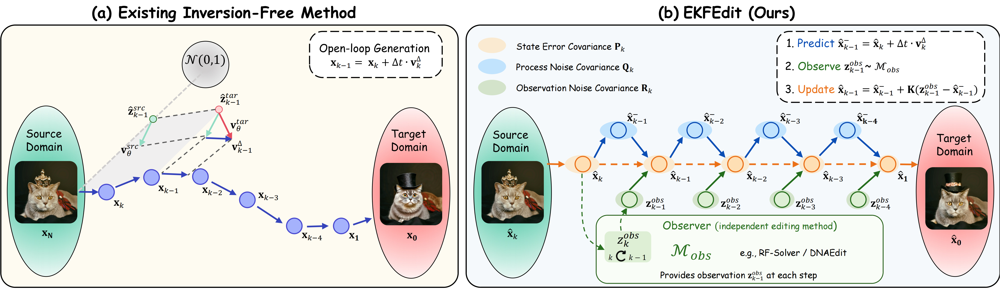

## [IJCAI2026] EKFEdit: Extended Kalman Filter for Training-Free Flow-Based Image Editing



### Environment

```bash
pip install -r requirements.txt
```

### Demo

```bash
python ekf_edit.py \
    --img_path assets/brown_owl.png \
    --source_prompt "A small, brown owl standing on a patch of grass." \
    --target_prompt "A small, glass sculpture of a brown owl standing on a patch of grass." \
    --tar_guidance_scale 5.5 \
```

```bash
python ekf_edit.py \
    --img_path assets/cat.jpg \
    --source_prompt "A opened eyes cat sitting on wooden floor." \
    --target_prompt "A closed eyes cat sitting on wooden floor." \
    --tar_guidance_scale 5.5 \
```

```bash
python ekf_edit.py \
    --img_path assets/free_wifi.png \
    --source_prompt "A wooden table with a black board on it. The board displays the words \"FREE WIFI\" in white letters. The table is positioned in the center of the scene, and the board is placed on top of it." \
    --target_prompt "A wooden table with a black board on it. The board displays the words \"FREE BEER\" in white letters. The table is positioned in the center of the scene, and the board is placed on top of it." \
    --tar_guidance_scale 7.5 \
```

```bash
python ekf_edit.py \
    --img_path assets/geese.png \
    --source_prompt "A flock of geese flying together in the sky. There are several geese, spread across the scene, with some flying higher and others lower. The geese are flying in a cloudy sky." \
    --target_prompt "A flock of flamingos flying together in the sky. There are several flamingos, spread across the scene, with some flying higher and others lower. The flamingos are flying in a cloudy sky." \
    --tar_guidance_scale 5.5 \
```

```bash
python ekf_edit.py \
    --img_path assets/parrot.png \
    --source_prompt "A colorful parrot perched on a tree branch. The parrot is predominantly blue, with a mix of red, green, and yellow colors. It sitting comfortably on the branch. The tree itself is filled with green leaves, creating a lush and vibrant backdrop for the parrot." \
    --target_prompt "A gray pigeon perched on a tree branch. The pigeon is predominantly gray. It sitting comfortably on the branch. The tree itself is filled with green leaves, creating a lush and vibrant backdrop for the pigeon." \
    --tar_guidance_scale 5.5 \
```

```bash
python ekf_edit.py \
    --img_path assets/man.png \
    --source_prompt "profile image of a man" \
    --target_prompt "profile image of a man with a beard." \
    --tar_guidance_scale 7.5 \
```

```bash
python ekf_edit.py \
    --img_path assets/roundcake.jpg \
    --source_prompt "A round cake with orange frosting on a wooden plate" \
    --target_prompt "A square cake with orange frosting on a wooden plate" \
    --tar_guidance_scale 9.5 \
```

```bash
python ekf_edit.py \
    --img_path assets/cat_dog_car.png \
    --source_prompt "A blue-gray Audi car parked in a grassy area. A white dog sitting on the grass, next to the car. A cat laying on the hood of the car." \
    --target_prompt "A blue-gray Audi car parked in a grassy area. A Dalmatian dog sitting on the grass, next to the car." \
    --tar_guidance_scale 5.5 \
```
